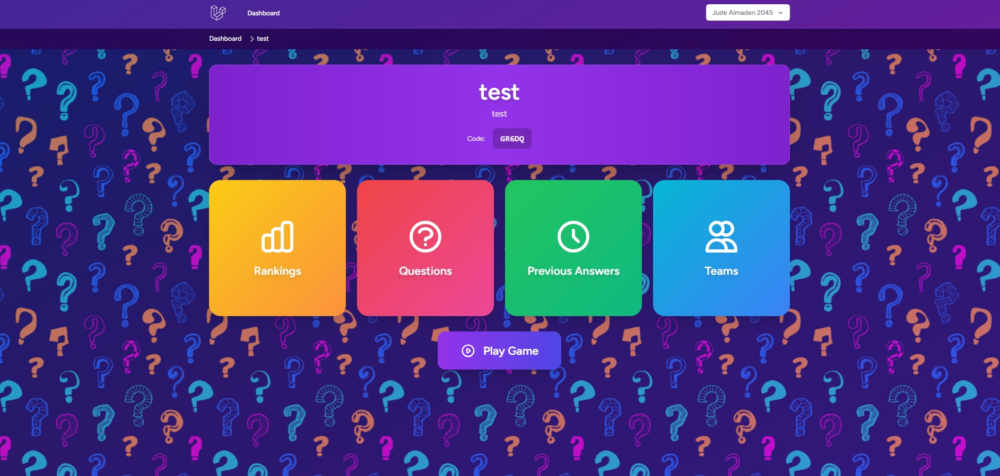
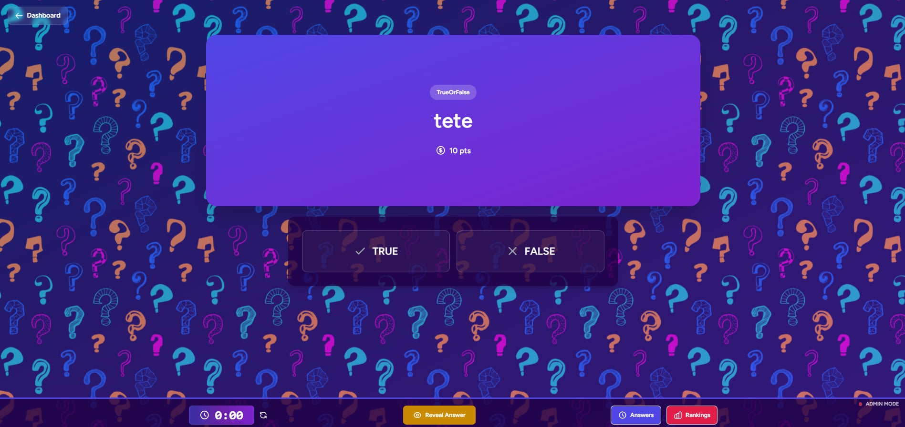

# QuizzlySpa - Interactive Quiz Management System

QuizzlySpa is a modern, real-time quiz application built with **Laravel**, **Vue.js**, and **Inertia.js**. It features a dynamic, vibrant UI with real-time gameplay, admin controls, and live rankings.

## 🚀 Features

### 🎮 Game Interface
- **Vibrant Theme**: Deep purple/violet gradients with animated background elements for an immersive experience.
- **Glassmorphism UI**: Modern, translucent UI components with frosted glass effects.
- **Real-time Updates**: Powered by Laravel Reverb/Echo for instant question reveals, timer sync, and score updates.

### 🛠 Quiz Administration
- **Dashboard**: Central hub to manage quizzes, create questions, and view participants.
- **Question Management**: Support for Multiple Choice, True/False, and Identification questions with timers and points.
- **Game Control**:
  - **Selection Phase**: Choose categories and specific questions.
  - **Timer Control**: Set custom timers (default 30s) and start countdowns.
  - **Answer Reveal**: Reveal answers to all participants simultaneously.
- **Live Rankings**: Real-time leaderboard tracking player scores and positions.

### 📱 Participant Experience
- **Mobile-Responsive**: Optimized for playing on any device.
- **InstantFeedback**: clear visual cues for correct/incorrect answers and score updates.
- **Answer History**: Detailed history of submitted answers for transparency.

## 📸 Screenshots

### Login & Authentication
*Secure and stylish entry point for admins and players.*


### Quiz Dashboard
*Manage your quizzes and track active sessions.*


### Game Admin View
*Control the game flow, start timers, and reveal answers.*


### Dynamic Rankings
*Live leaderboard showing top teams and scores.*


## 🛠 Tech Stack

- **Backend**: Laravel 11
- **Frontend**: Vue.js 3 (Script Setup), Tailwind CSS
- **Full Stack**: Inertia.js
- **Real-time**: Laravel Reverb
- **Database**: MySQL/SQLite

## ⚡ Getting Started

1. **Clone the repository**
   ```bash
   git clone https://github.com/yourusername/quizzly-spa.git
   ```

2. **Install Dependencies**
   ```bash
   composer install
   npm install
   ```

3. **Setup Environment**
   ```bash
   cp .env.example .env
   php artisan key:generate
   ```

4. **Run Migrations**
   ```bash
   php artisan migrate
   ```

5. **Start Development Servers**
   ```bash
   # Terminal 1: Laravel Server
   php artisan serve

   # Terminal 2: Vite Dev Server
   npm run dev

   # Terminal 3: Reverb Server (for generic real-time features)
   php artisan reverb:start

   # Terminal 4: Queue Worker
   php artisan queue:listen
   ```

## 📝 License

This project is open-sourced software licensed under the [MIT license](https://opensource.org/licenses/MIT).
